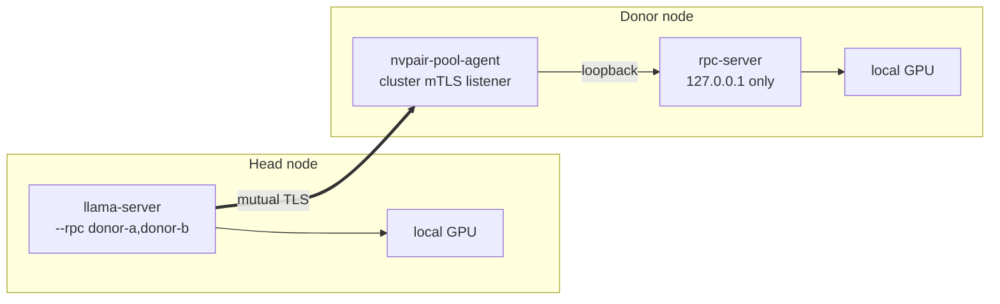

{/*
SPDX-FileCopyrightText: Copyright (c) 2026 NVIDIA CORPORATION & AFFILIATES. All rights reserved.
SPDX-License-Identifier: Apache-2.0
*/}

# Distributed inference and GPU pooling

PAIR's [README](../README.md) states what it does not do, and states it first
because it is the most common misreading of a router:

> PAIR routes each independent request to one node. It does **not** pool GPU
> memory, combine GPUs into a larger logical GPU, shard one model across
> machines, or split an in-flight inference request between nodes.

This document is the design for making that paragraph out of date on purpose:
adding a second, explicitly-entered mode in which several nodes' VRAM backs one
model and one request executes across all of them. Routing is unchanged and
remains the default. Pooling is what happens when routing has nowhere to route
to, because no single node can hold the model.

It is a design, not a description of shipped behavior.

## What pooling buys, and what it costs

Being precise about this first avoids the disappointment that otherwise arrives
with the first benchmark.

**Pooling buys capacity.** Three machines with 16 GB each can hold a model that
needs 40 GB. Without pooling that model cannot run at all; with it, it runs.

**Pooling costs latency, and it does not buy throughput.** Layer-split
inference is *sequential*: node A computes layers 0–27, hands the hidden state to
node B, which computes 28–55, and so on. Only one device is busy at a time. Three
pooled GPUs are not three times faster than one — they are somewhat slower than a
single GPU that could have held the whole model, and the gap is the network.

The right mental model is a **swap file made of other people's VRAM**. You reach
for it when the alternative is not running, not when the alternative is running
on one box.

This is also why pooling and routing are complements rather than alternatives. A
cluster should route small models across nodes for concurrency — which is what
PAIR already does well — and pool only for the one model that does not fit.

## Mechanism

The sharding itself is `ggml`'s RPC backend, which `llama.cpp` already
implements and which exists for exactly this purpose. A donor machine runs
`rpc-server`, which exposes its local `ggml` device — CUDA, Metal, Vulkan, or
CPU — over a socket. The head machine runs `llama-server` with those donors
listed as additional backends, and the loader distributes layers across the
combined device set according to a tensor-split proportion.

PAIR does not reimplement any of that. What PAIR adds is everything around it,
which is the part that does not exist today:

- knowing how much VRAM every node in the cluster actually has free, continuously;
- deciding whether a given model *can* fit, and across which nodes;
- computing the split, rather than making the user hand-write `--tensor-split`;
- starting a donor on one machine and a head on another, in the right order, and
  tearing both down when the pool is no longer wanted;
- carrying the RPC stream over a transport that is safe to put on a network; and
- presenting the result to the proxies as something they can route to.

### llama.cpp as a third engine

`nvpair-engine-manager` is already a manifest-driven control plane: `manifests/`
holds one JSON file per engine describing detection, install, runtime, readiness,
health, and actions, and Ollama and LM Studio are both just data in that format.
llama.cpp becomes the third manifest, with one addition — a runtime that has two
**modes** rather than one:

| Mode | Process | Binds | Role |
| --- | --- | --- | --- |
| `server` | `llama-server` | Loopback, like every other engine | Head of a pool; also a perfectly ordinary standalone engine |
| `rpc` | `rpc-server` | **Loopback only** | Donor: contributes this node's VRAM to a pool headed elsewhere |

A node in `rpc` mode is not serving inference and holds no model of its own. It
is lending memory.

**Pooling is a GGUF and llama.cpp feature, not a PAIR-wide one.** Ollama's runner
does not expose its backends for cross-machine sharding and LM Studio's is
closed, so a model pulled into either of them cannot be pooled. A pooled model is
a GGUF file that llama.cpp loads. Saying this early is kinder than letting
someone discover it after installing three donors.

### The security problem, and the answer

The `ggml` RPC protocol has no authentication and no hardening. Upstream is
unambiguous that it must never be exposed to an open or untrusted network: it
deserializes tensor and buffer descriptors from the wire and hands them to a
backend, which makes a malicious peer's path to arbitrary memory access in the
server process short. Binding `rpc-server` to `0.0.0.0` is the single most
dangerous thing this feature could do, and it is also the obvious way to
implement it, which is why it is worth naming.

PAIR's answer is the rule it already applies to every engine, applied again:

> Engines started by PAIR bind to loopback, so a peer never reaches another
> node's engine directly. It goes through that node's proxy, which is the only
> cluster-facing entry point.

`rpc-server` binds `127.0.0.1` and nothing else. A new cluster-scoped listener —
`nvpair-pool-agent` — terminates mutual TLS on the network side, verifies the
caller against the same pinned-member gate every other cluster service uses, and
splices the stream to the loopback `rpc-server`. The `ggml` wire never crosses a
socket an unpinned party can open, on any interface, at any point.



Three further constraints follow from the same reasoning, and each is cheap:

- **Donor mode is opt-in per node and revocable at any time.** Lending a machine's
  VRAM — and, through `ggml` RPC, a good deal of its process memory safety — to
  the cluster is a decision the machine's owner makes explicitly, not a
  consequence of pairing.
- **A node refuses donor mode while unclustered.** There is no pinned peer to
  authenticate, so there is nobody who may legitimately connect.
- **A donor accepts exactly one head at a time,** and only for the pool it agreed
  to join. `rpc-server` has no concept of sessions; the agent supplies it.

## Capacity accounting

Pooling starts from a question PAIR cannot currently answer: how much VRAM is
free, right now, on every node.

`nvpair-node-info` already reports `vram_bytes` and `vram_used_bytes` per GPU, so
the raw material is present. What is missing is the cluster-wide view and the
distinction between memory that is free and memory that is *available to lend*:

```json
{
  "name": "NVIDIA GeForce RTX 5080",
  "vram_bytes": 17179869184,
  "vram_used_bytes": 2147483648,
  "pool": {
    "donor_enabled": true,
    "reserved_bytes": 1073741824,
    "committed_bytes": 0
  }
}
```

`reserved_bytes` is headroom the node keeps for itself — a desktop that also
renders its own display should not lend its last gigabyte. `committed_bytes` is
what an existing pool already claimed, so a second pool does not plan against
memory that is spoken for.

## Planning a split

`shared/vrampool` is the planner: pure arithmetic over device descriptions and a
model requirement, with no engine, no network, and no GPU involved, which is what
makes the interesting part of this feature testable on a laptop.

**Inputs.** From the model: total weight bytes, layer count, embedding width,
KV-head width, and element size — all available from GGUF metadata without
loading anything. From the request: context length. From the cluster: one device
record per GPU per node, each carrying free VRAM and the link class from
[the mesh design](wide-area-mesh.mdx).

**Cost model.** Per-layer weights are approximated as the repeating-block share of
the file, with non-repeating tensors — embeddings and the output head — charged
to the head node, where llama.cpp keeps them. KV cache is charged per layer per
device:

```
kv_bytes_per_layer = 2 * n_embd_kv * element_bytes * n_ctx
```

Both estimates are then reduced by a headroom fraction, because planning to the
last free byte fails on fragmentation, on the compute buffer, and on the first
context that runs longer than the one that was planned for. Reserving a fraction
that looks wasteful on paper is the difference between a pool that loads and one
that dies at 96%.

**Assignment.** Devices are ordered by link quality first and capacity second,
then filled in that order until every layer is placed. The ordering decision is
the consequential one, and it goes against the instinct a throughput scheduler
would have: layers are *not* spread proportionally across everything eligible.

Spreading them evenly maximizes the number of machine boundaries, and every
boundary adds a serialized round trip to every generated token. A model that
would have fitted on two machines, spread across five, is several times slower
and no more capable. Filling the best-connected device first uses the fewest
machines that can hold the model, which is also the fastest arrangement that can
hold it. Each device's share is a consecutive run of layers, because layers are
evaluated in order and a non-adjacent share would cross the network twice for
nothing.

Link quality is ordered ahead of capacity for the same reason. Filling a large
wireless GPU before a smaller wired one produces a pool that holds the model and
then generates at the speed of the radio — capacity nobody can use.

**Why the network cost has two very different shapes** — and why the plan needs
both link RTT and link bandwidth rather than one number:

| Phase | What crosses the link | Sensitive to |
| --- | --- | --- |
| Model load | Every weight the donor holds — gigabytes, once | **Bandwidth.** Loading 20 GB onto a donor over 802.11ac is tens of minutes |
| Prompt processing | Hidden state for the whole batch: `n_embd × n_batch × 4` bytes per boundary | **Bandwidth.** A long prompt moves hundreds of megabytes |
| Token generation | Hidden state for one token: `n_embd × 4` bytes per boundary — tens of kilobytes | **Round-trip time.** The bytes are trivial; the serialized hop is not |

So a donor on a fast, high-latency link generates slowly. A donor on a slow,
low-latency link loads slowly and then runs acceptably. A donor on Wi-Fi is
usually both. Where the pinned llama.cpp build supports a donor-side tensor
cache, enabling it removes the load transfer from every run after the first,
which is the single largest quality-of-life improvement available for a
wireless donor.

**Link class is a gate, not a preference.** The pool planner refuses a donor
whose class is `wan`, and warns on `wifi`, for a reason the scheduler does not
have to care about: correctness. Which brings us to the failure model.

## The pool is only as available as its worst member

`llama.cpp` cannot survive a backend disappearing mid-load or mid-request. There
is no re-sharding, no failover, and no partial result. A donor that goes away
takes the pool with it, and the in-flight request fails.

That single sentence sets most of the operational policy:

- **Pool health is the minimum of its members' health,** and it is reported that
  way rather than as an average that hides the problem.
- **Donor churn is the enemy.** A laptop that roams between networks, sleeps, or
  rides a flapping Wi-Fi link is a bad donor even when it has the most free VRAM
  in the cluster. This is the direct dependency on
  [the mesh design](wide-area-mesh.mdx): without a link class, PAIR cannot tell a
  good donor from a bad one until it has already lost a request to it.
- **Teardown is explicit and ordered.** Head first, then donors, so the donors are
  never left holding buffers for a head that is gone.
- **A pool never forms silently.** It is a heavyweight, whole-cluster commitment
  of memory, and it appears in the interface as a thing that exists, with its
  members, its split, and its cost.

## Routing a pool

The proxies should not learn a second routing model, and they do not have to.

`nvpair-pool-manager` presents a formed pool as an **ordinary advertised owner of
its model, located on the head node**. The head is a real node with a real
address and a real engine; the proxy's existing candidate selection —
model-eligibility gate, then scheduler order, then failover — applies unchanged.
Every consequence of the current design carries over for free, including the rule
that a peer request is served rather than re-routed.

Two adjustments make the scheduler's picture honest:

- **The pool's pending work is charged to every member,** not only to the head.
  A donor whose GPU is fully committed to a pool is not idle, and ranking it as
  idle would steer ordinary routed requests onto a machine with nothing to serve
  them with.
- **A pooled model is not a failover target for an unpooled one.** Falling back
  from a fast single-node owner to a pool is a large, silent latency change, and
  it should be a decision rather than an accident.

Formation itself is either **on demand** — a request names a model that fits
nowhere, and the cluster has the memory in aggregate — or **pinned** by the user,
which is the sensible default for a model someone intends to use all day.
On-demand formation is subject to admission control: if the model does not fit
even pooled, the honest answer is an actionable local error, which is the same
shape the proxy already returns when no owner is routable.

## Distributed AI operations

Pooling is the hardest piece, but it is not the whole of "distribute AI ops," and
the accounting layer it requires unlocks work that is cheaper and helps more
clusters:

- **Model residency and warmness.** PAIR already knows which models are loaded
  and shows it, but routing does not use it, so a request can be sent to a node
  that must cold-load a model while a node holding it warm sits one place lower.
  Once free VRAM is tracked cluster-wide, "prefer a node with it already
  resident" becomes a small change with a large effect.
- **Admission control.** A request naming a model that fits nowhere should fail
  fast and locally rather than after a timeout.
- **Placement rather than reaction.** With per-node capacity known, PAIR can
  decide *where a model should be pulled* rather than only which node happens to
  have it.
- **Fan-out for multi-agent workloads,** which is PAIR's stated use case: a batch
  of independent requests is a scheduling problem the current one-at-a-time path
  under-serves.

None of these need llama.cpp, and all of them need the same VRAM accounting the
pool planner needs. That is why the accounting lands first.

## Phases

1. **`shared/vrampool` and free-VRAM reporting.** The planner, its cost model,
   and per-GPU availability in `nvpair-node-info`. Testable with no engine, no
   second machine, and no GPU.

   *The planner half of this exists*: `services/shared/vrampool` implements the
   cost model, the donor policy and its rejection reasons, and the allocator, with
   tests. Nothing imports it yet, and `nvpair-node-info` does not yet report the
   free-VRAM and donor fields it consumes.
2. **llama.cpp as an engine,** in `server` mode only. Useful on its own: a third
   engine for GGUF models.
3. **Donor mode and `nvpair-pool-agent`,** including the loopback binding and the
   mutual-TLS splice. This is the security-critical change and deserves its own
   review.
4. **`nvpair-pool-manager`:** formation, admission, lifecycle, teardown.
5. **Integration:** pool-as-owner in the proxies, member charging in the
   scheduler, and the interface.

## What this does not do

- **It is not tensor parallelism.** Layers run in sequence, so adding nodes adds
  capacity, not speed.
- **It does not apply to Ollama or LM Studio models.** Pooling is llama.cpp and
  GGUF.
- **It is not fault tolerant.** Losing a donor fails the request and the pool.
- **It is not faster than a single GPU that fits the model.** If the model fits on
  one node, route to it — PAIR already does.
- **It does not make an untrusted machine safe to lend memory to.** A donor runs
  code shaped by the head's requests; pool only with machines you would already
  trust with the model and the prompt.
