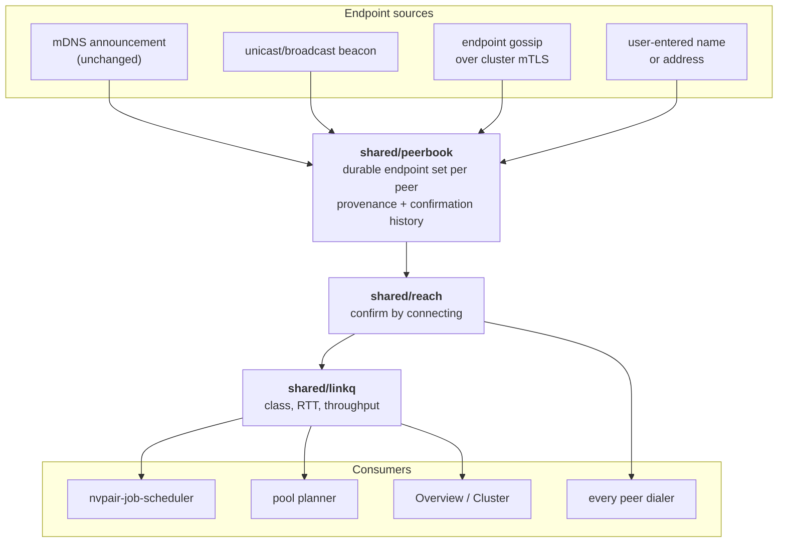

{/*
SPDX-FileCopyrightText: Copyright (c) 2026 NVIDIA CORPORATION & AFFILIATES. All rights reserved.
SPDX-License-Identifier: Apache-2.0
*/}

# Wide-area mesh

PAIR today is a LAN cluster. Nodes find each other with multicast DNS, dial each
other at the addresses that multicast carried, and every link is assumed to be
the same link. This document is the design for removing all three assumptions so
a cluster can span Wi-Fi networks, subnets, and locations — without giving up the
pairing model, the mutual-TLS trust boundary, or the "one canonical path" rule
the rest of the codebase is built on.

It is a design, not a description of shipped behavior. Refer to
[Architecture](architecture.mdx) for what PAIR does today.

## What breaks, and why

Three separate failures hide behind "it doesn't work on my Wi-Fi." They have
different causes and different fixes, and conflating them is why a single change
never solves the problem.

### 1. The announcement never arrives

`_nvpair-node._tcp` is announced to `224.0.0.251` with a TTL of 1. That packet is
dropped, routinely and by design, by:

- **Access-point client isolation.** A guest or "secure" SSID that forbids
  station-to-station traffic drops the announcement *and* every unicast packet
  between the two nodes. Discovery is not the only casualty here; nothing on the
  link works.
- **IGMP snooping and multicast rate limiting.** Consumer and enterprise APs
  alike drop or heavily rate-limit multicast, because multicast on Wi-Fi is
  transmitted at the lowest basic rate and is expensive airtime. A busy AP sheds
  it first.
- **Split SSIDs and band steering.** 2.4 GHz and 5 GHz presented as separate
  networks, or a mesh extender bridging onto a different segment, puts two nodes
  in the same room on two different broadcast domains.
- **Any router at all.** Multicast DNS is link-scoped by construction. Two
  subnets in one house is enough.

### 2. The address means nothing where it arrives

Suppose discovery is fixed. `192.168.1.34` is still not an address a node on a
hotspot, a different VLAN, or another building can use. Worse, it is not even
wrong in a detectable way: it is very likely a *different, real machine* on the
receiver's own network. PAIR guards against acting on that — the peer is
authenticated by its pinned certificate before anything is exchanged, so a
wrong-network collision fails the handshake rather than leaking to a stranger —
but the peer is still unreachable.

And addresses churn. A laptop that moves between home, office, and a phone
hotspot has three addresses in a day and none of them is durable. The roster
entry that recorded one of them is stale the moment the machine roams.

### 3. Every link looks identical

`nvpair-job-scheduler` ranks nodes by pending work and GPU pressure. Nothing in
its input says whether a candidate is across a 10 GbE switch or a congested
2.4 GHz link with 40 ms of jitter. On a LAN that omission is harmless, because
the assumption behind it is true. The moment a cluster spans links of different
quality, it is the dominant term the scheduler cannot see — and, as
[GPU pooling](gpu-pooling.mdx) shows, it becomes a correctness question rather
than a performance one, because a pool member on a flapping link takes the whole
pool down with it.

## Principles

These constrain every choice below.

1. **Pairing decides membership; discovery only decides reachability.** Today
   these are entangled, because a node nobody can see is a node nobody can use.
   Separating them is most of the work: an unreachable member should read as
   *unreachable*, not as absent.
2. **Multicast becomes one source of candidates, not the mechanism.** It stays,
   because it is genuinely the best answer on a friendly LAN — zero
   configuration, no dependency on any peer already being up. It stops being
   load-bearing.
3. **No new trust.** Every new channel rides the mutual-TLS pins
   `nvpair-cluster-manager` already issues. The six-digit PIN remains the only
   bootstrap, and nothing below introduces a second way to join a cluster.
4. **No port forwarding, and no public surface.** [SECURITY.md](../SECURITY.md)
   tells operators not to forward PAIR ports through a router. A wide-area
   design that requires them to is not a design, it is a shifted burden.
5. **Reachability is confirmed by connecting.** `shared/reach` already encodes
   this: a published address is evidence, and the TCP handshake is the proof.
   Every new endpoint kind enters that same funnel.
6. **Degrade honestly.** A peer reachable only by a relayed hop over a metered
   phone tether is reachable, and it is also not the same thing as a peer on the
   switch. Both the interface and the scheduler should be told which one they
   have.

## Architecture

Three layers, added in that order.

### Endpoints, not addresses

A peer is described by a *set* of endpoints with provenance, not by one address.

| Kind | Where it comes from | Durability |
| --- | --- | --- |
| `local` | The peer's own interface addresses — today's `ips=` list | Valid only on that link |
| `reflexive` | The `host:port` a peer observed us connecting *from*, reported back to us over the authenticated channel | Valid while the NAT binding lives |
| `name` | A DNS name the user configured for the node, including dynamic-DNS | Durable; the only genuinely stable answer |
| `mapped` | An explicit port-forward, or a UPnP-IGD / NAT-PMP lease the user opted into | Durable while the lease holds |
| `relay` | "Reachable via peer X", published by whichever peer can currently carry it | Valid while X is reachable from both ends |

The reflexive endpoint deserves a note, because it is the piece that usually
requires a STUN server. PAIR does not need one. Every cluster peer already
terminates a mutual-TLS connection from us and can therefore see our
post-NAT source address; reporting it back on a channel we already trust is
strictly better than asking a third party, and it introduces no new dependency
and no new operator. A peer can of course *lie* about what it observed — which
costs it nothing, because a reflexive endpoint is a candidate to be probed, never
an identity, and probing it terminates in the same certificate check as any other
path.

Endpoint sets do not go into the mDNS TXT record. That record is size-limited and
already at its useful capacity; this is the same call the project made when the
model list moved from TXT to `nvpair-engine-manager`'s HTTP endpoint. Endpoint
sets travel on the gossip channel described next.

### `shared/peerbook` — the durable address book

One file per known peer, keyed by node UUID, holding its endpoint set with, per
endpoint: kind, address, the source that reported it, when it was last seen
advertised, when it last completed a handshake, and a consecutive-failure count.

It answers one question — *in what order should I try to reach this peer right
now* — and it answers it across restarts and across networks. Ranking is by
evidence rather than by address class, following `shared/netpick`'s existing
reasoning: an endpoint that completed a handshake ninety seconds ago outranks one
that has never been tried, whatever subnet either is on.

The book is the reason a cold start on a new network works at all. A laptop that
opens on hotel Wi-Fi has no multicast peers and no valid `local` endpoints for
anyone, but it has yesterday's `name`, `mapped`, and `reflexive` entries for
every member, and it tries them all concurrently.

### Discovery without multicast

Four sources feed the book, all optional, none load-bearing on its own.

**mDNS** is unchanged. It remains the fastest path on a network where it works
and it needs no peer to already be up.

**A unicast beacon** carries the same record over UDP to the subnet broadcast
address and `255.255.255.255`. This is deliberately unglamorous: it exists for
exactly the case where an AP drops multicast but forwards broadcast, which is a
large fraction of consumer Wi-Fi. It adds no information that mDNS did not
already publish, so it widens no exposure, and it is skipped on interfaces where
mDNS is working.

**Endpoint gossip** is the authoritative source and the one that makes roaming
work. `nvpair-cluster-manager` already runs a 30-second roster reconcile over
mutual TLS in which peers exchange their view of the cluster; that exchange gains
an endpoint set per member. One reachable peer is then enough to learn every
member's current endpoints — including for members that peer cannot itself reach,
because it forwards what it was told along with when it was told. A node that
roams tells whoever it can reach, and the news propagates in one reconcile
interval.

**A user-entered name or address** seeds the whole thing. `nvpair-manual-nodes`
already accepts one, and already prefers a hostname over an IP literal for
precisely the renumbering reason above.

That leaves one honest gap: a node whose every recorded endpoint is stale and
which can reach no peer has no way in. There is no rendezvous server in this
design, so bootstrapping requires either one reachable peer or one durable name.
That is a deliberate trade — a rendezvous server is an operator, an outage, and a
metadata leak — and it should be stated in the interface rather than papered over.

### Reaching a peer that cannot be dialed

Candidate probing extends `shared/reach` to walk the whole endpoint set rather
than the `ips=` list, concurrently, exactly as it does today.

When no direct endpoint answers, the fallback is a **relay**: any member with a
confirmed path to both ends carries the connection as an opaque byte stream.

The critical property is that the relay terminates nothing. Mutual TLS is
established end to end *through* the pipe, so the relaying node sees ciphertext,
and neither end's certificate check is weakened by the extra hop. A relay can
therefore observe that two peers are talking, how much and when, and it can drop
the connection. It cannot read the traffic, forge it, or impersonate either end.
Since a relay is by construction an already-pinned cluster member, this adds no
party to the trust set — only a new capability for a party already inside it,
which is worth saying out loud in [SECURITY.md](../SECURITY.md) rather than
leaving implied.

**NAT hole punching is deliberately out of scope for the first version.** TCP
simultaneous open succeeds through too few NATs to rely on, and doing it properly
means a UDP transport, which means QUIC, which means re-homing every peer service
off `net/http` over TCP. Relaying is a fraction of the work, always succeeds when
*any* member is mutually reachable, and is needed anyway as the fallback path a
hole-punching implementation would fall back to. Hole punching is an optimization
to add later, underneath an interface that already exists.

**UPnP-IGD and NAT-PMP leases stay opt-in and off by default,** for the reason
SECURITY.md gives: silently opening an inbound path through a user's router is
not a decision PAIR should make on their behalf.

### `shared/linkq` — knowing a Wi-Fi hop is a Wi-Fi hop

Two inputs, neither of which costs the user anything.

**Local interface classification** answers what kind of radio or wire an address
lives on, from the operating system: `IF_TYPE_IEEE80211` from
`GetAdaptersAddresses` on Windows, `/sys/class/net/<if>/wireless` and
`/sys/class/net/<if>/type` on Linux, and the `IOKit` service class on macOS.
A node classifies its own interfaces and publishes the class alongside the
endpoint, because only the node itself can see this.

**Measured path quality** is taken from traffic that was going to happen anyway:
round-trip time from the existing reconcile and telemetry requests, and a
throughput estimate from the byte counts and durations of real inference
responses. Nothing synthetic is injected. A bandwidth probe on a metered phone
tether is a cost the user did not agree to, and a periodic one is a cost they pay
forever.

The result is a small, coarse classification per path — deliberately coarse, in
the same spirit as the scheduler's 0–3 GPU pressure:

| Class | Meaning |
| --- | --- |
| `local` | Loopback; this node |
| `lan` | Same subnet, wired, sub-millisecond |
| `wifi` | Wireless anywhere on the path |
| `wan` | Routed, relayed, or otherwise off-site |
| `unknown` | Not yet measured — treated as neutral, never as good |

Consumers: the scheduler adds a link penalty so a wired peer wins ties against a
wireless one; the pool planner in [GPU pooling](gpu-pooling.mdx) uses it as a
hard gate rather than a preference; the interface shows it, because "why is that
node never picked" should be answerable by looking.

## Services and ports

The work lands as one new supervised worker plus additions to existing ones. No
existing port changes meaning.

| Component | Change |
| --- | --- |
| `shared/peerbook` | New. Durable endpoint sets, provenance, ranking. |
| `shared/linkq` | New. Interface classification and path-quality tracking. |
| `nvpair-mesh` | New optional worker. Beacon transmit/receive, address-book replay on start and on network change, path selection, relay data plane. |
| `nvpair-cluster-manager` | Roster reconcile carries endpoint sets and the observed reflexive address. |
| `nvpair-node-scanner` | mDNS results become one input to the book rather than the directory itself. |
| `shared/reach` | Walks endpoint sets; records outcomes back into the book. |
| `nvpair-job-scheduler` | Accepts a link class per node and applies a penalty. |
| `nvpair-ui-broker` | Supervises `nvpair-mesh`; relays its state. |

`nvpair-mesh` is optional and non-fatal, like every worker but the scanner. A
build without it is exactly today's LAN-only PAIR, which is also the correct
fallback if it crashes.

## Security

Wide-area operation invalidates an assumption the current threat model rests
on. [SECURITY.md](../SECURITY.md) says the local network is a trust-relevant
boundary and that some enrichment and node-information traffic is plain HTTP —
which is a considered trade when "local network" means one subnet you control.
It is not a considered trade when a cluster member is three networks away.

The rule that follows is narrow and load-bearing:

> **Only mutual-TLS services are reachable over a non-link path.** The relay
> carries cluster-gated services only. `nvpair-node-info`'s plaintext
> personality — hostname, hardware inventory, utilization — stays link-local and
> is never relayed, tunneled, or published to an off-link endpoint.

Without that rule, the first wide-area cluster would quietly move unauthenticated
telemetry onto the open internet. With it, going wide-area adds no plaintext
surface at all.

The remaining new surfaces:

| Surface | Exposure | Mitigation |
| --- | --- | --- |
| Broadcast beacon | Same fields mDNS already publishes, same link | No new information; opt-out per interface |
| Endpoint gossip | Members' addresses and link classes | Inside existing cluster mTLS; readable only by pinned members |
| Reflexive report | A peer can claim any address | Candidate only; proved or disproved by connecting, which ends in a certificate check |
| Relay | Traffic volume and timing between two members; ability to drop | End-to-end mTLS through the pipe; relay is an already-pinned member |
| Address book on disk | Where a user's other machines are | Same directory and protection as cluster keys |

## Phases

Each phase is independently useful and independently shippable.

1. **`shared/peerbook` and `shared/linkq`.** Pure data structures and platform
   probes, testable without a second machine. Nothing consumes them yet.
2. **Endpoint gossip on the existing reconcile channel,** plus reflexive
   reporting. No new port, no new worker. This alone fixes roaming inside one
   site.
3. **`nvpair-mesh`:** beacon, book replay on network change, path selection.
   This fixes multicast-hostile Wi-Fi.
4. **Relay data plane.** This fixes cross-network and NAT.
5. **Consumption:** scheduler penalty, interface display, and the pool planner's
   donor gate.

## What this does not do

Stated plainly, because each is a reasonable thing to expect from the words "mesh
across Wi-Fi" and none of them is what this is.

- **It is not a VPN.** No virtual addresses, no subnet routing, no traffic from
  non-PAIR applications. Only PAIR's own peer services cross the mesh.
- **It does not make a node reachable from the public internet,** and it does not
  make PAIR safe to expose there. Every path still terminates in a pinned
  certificate check.
- **It does not remove the cold-start requirement.** One reachable peer, or one
  durable name, is needed to re-enter a cluster from an unknown network.
- **It is not Wi-Fi Direct.** Nodes still use whatever network they are on.
  Access-point-free peer-to-peer radio links are a different feature with
  platform-specific permission models on all three operating systems.
- **It does not make a slow link fast.** It makes a slow link *visible*, which is
  what lets everything above it make a better decision.
